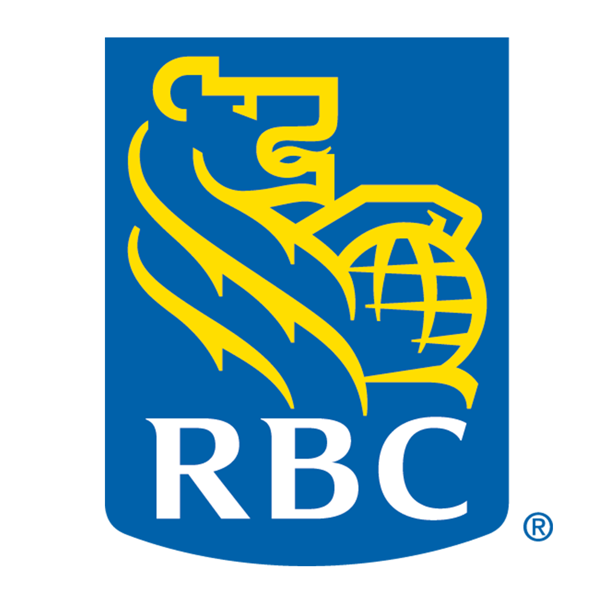

## BlackBerry
- *Junior Cyber Forensics Analyst Co-op* | May 2023 - August 2023
- 
- Tags: Tech
- Badges:
  - Cybersecurity [red]
  - Digital Forensics [red]
- List Items:
  - Responsible for handling digital forensic requests from internal stakeholders
  - Maintained the Forensic Lab environment & tools in accordance to policies & procedures
  - Supported collection of data for Chain of Custody procedures

## Royal Bank of Canada
- *Automation Analyst Co-op* | January 2022 - July 2022
- 
- Tags: Tech
- Badges:
  - Process Automation [yellow]
  - Web Development [yellow]
- List Items:
  - Supported Technology & Operations Supplier Management Office by developing solutions to meet clients’ growing needs for automation and enhancing process controls & governance
  - Automated Tableau, SharePoint and Excel processes using VBA and Python
  - Developed custom SharePoint sites for internal & external stakeholders using ASP.NET

## RBC Investor & Treasury Services
- *Automation Developer Co-op* | September 2021 - December 2021
- 
- Tags: Tech
- Badges:
  - DevOps Automation [blue]
  - Data Analytics [blue]
- List Items:
  - Supported the Site Reliability Engineering & Automation team by developing solutions to meet internal clients’ needs for DevOps automation
  - Created scripts using Python & PowerShell to retrieve data automatically for Tableau
  - Created a Splunk dashboard for monitoring applications and ServiceNow tickets

## Royal Bank of Canada
- *Automation Analyst Co-op* | May 2021 - September 2021
- 
- Tags: Tech
- Badges:
  - Process Automation [yellow]
  - Web Development [yellow]
- List Items:
  - Automated supplier risk reporting processes by using SharePoint, Tableau, and VBA
  - Created a SharePoint site for Quarterly Third-Party Risk Performance Monitoring surveys that tracks data through a Tableau dashboard
  - Assisted Supplier Management operations by updating & refreshing dashboards

## Royal Bank of Canada
- *Junior Strategy Analyst Co-op* | January 2018 - April 2018
- 
- Tags: Business
- Badges:
  - Data Analytics [purple]
  - Business Intelligence [purple]
- List Items:
  - Produced financial metric reports, scorecards and graphs on a monthly & quarterly basis
  - Analyzed performance through data analytics by utilizing Tableau, MS Access & Excel
  - Improved and enhanced the reporting process by streamlining and automating reports

## Royal Bank of Canada
- *Reconciliation Officer Co-op* | September 2017 - December 2017
- 
- Tags: Business
- Badges:
  - Accounting [green]
  - Finance [green]
- List Items:
  - Supported the Finance Shared Services Team in auditing and executing monthly GL processes and reconciliations
  - Saved $760 per year through streamlining reconciliation processes and excel templates which enhanced workflow

## Canada Revenue Agency
- *Non-Filer Officer Co-op* | January 2017 - April 2017
- 
- Tags: Business
- Badges:
  - Government [cyan]
  - Taxation [cyan]
- List Items:
  - Responsible for ensuring compliance with the filing requirements of individuals, businesses, corporations and trusts as outlined in the Income Tax Act
  - Presented digital process improvements to the Innovation Committee, aimed at reducing wait times for officers by ensuring consistency in letter creation, thus showcasing potential cost saving

